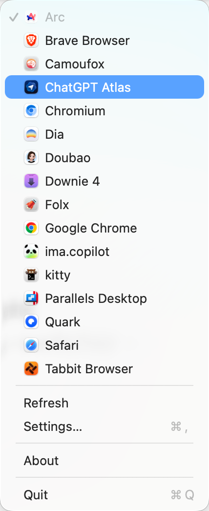

<div align="center">

# Default Browser Switcher

**English** · [简体中文](README.zh-CN.md) · [日本語](README.ja-JP.md)

**A lightweight macOS menu bar app for people who keep more than one browser open and want the default one to keep up with the way they work.**

**Switch the browser your links open in without digging through System Settings every time your workflow shifts from Safari to Arc, Chrome, Firefox, or something else.**

</div>

<p align="center">
  
</p>

## Why This Exists

Modern Mac setups rarely revolve around a single browser anymore. One browser is where work accounts stay signed in, another is where a project already has the right tabs open, another feels better for testing, and another is simply the one you want for the next few hours. Once that becomes normal, changing the default browser stops being an occasional setup task and starts becoming a small but annoying interruption.

`Default Browser Switcher` is built for that everyday rhythm. It gives you a faster, more native-feeling way to move your default browser when your focus changes, so links opened from apps, tools, or the system are more likely to land exactly where you want them without the usual settings detour.

## What You Can Do

- See your current default browser from the menu bar.
- One-click switch to another installed browser.
- Refresh browser discovery so the current default browser state and available browser list are read again.
- Choose between `LaunchServices Direct` and `System Prompt` browser switching modes.
- Turn launch-at-login on or off.

## Settings

Open `Settings…` from the menu bar to manage the app.

- `Default web browser`: pick the browser you want links to open in.
- `Refresh current browser`: re-read the current system discovery result so the displayed default browser and available browser list stay up to date. Use it after a switch, after installing or removing a browser, or anytime the current state looks off.
- `Switch mode`: choose between two implementations.
  - `LaunchServices Direct` is the default. It rewrites the user LaunchServices browser handlers directly, which is usually faster and usually avoids the macOS confirmation dialog.
  - `System Prompt` uses the official macOS API and is more conservative, but macOS may ask you to confirm the browser change.
- `Launch at login`: decide whether the app starts automatically when you sign in.

If you want to change the implementation later, open `Settings…` from the menu bar and switch the `Switch mode` picker.

## 🛠️ Troubleshooting

### macOS says the app is damaged and can't be opened?

Because of macOS security protections, apps downloaded outside the App Store can sometimes trigger this warning. You can fix it with either of the options below:

1. `Terminal fix` (recommended)

   Open Terminal and run:

   ```bash
   sudo xattr -rd com.apple.quarantine "/Applications/DefaultBrowserSwitcher.app"
   ```

   > Note: If you renamed the app, update the path in the command to match the actual app name and location.

2. Or open `System Settings` -> `Privacy & Security` and click `Open Anyway`.

## Development

Build:

```bash
xcodebuild -scheme DefaultBrowserSwitcher -project DefaultBrowserSwitcher.xcodeproj -destination 'platform=macOS' build
```

Test:

```bash
xcodebuild test -scheme DefaultBrowserSwitcher -project DefaultBrowserSwitcher.xcodeproj -destination 'platform=macOS'
```

Optional verification:

```bash
bash Scripts/verify-s01.sh
bash Scripts/verify-s02.sh
```

## License

[MIT](LICENSE)
